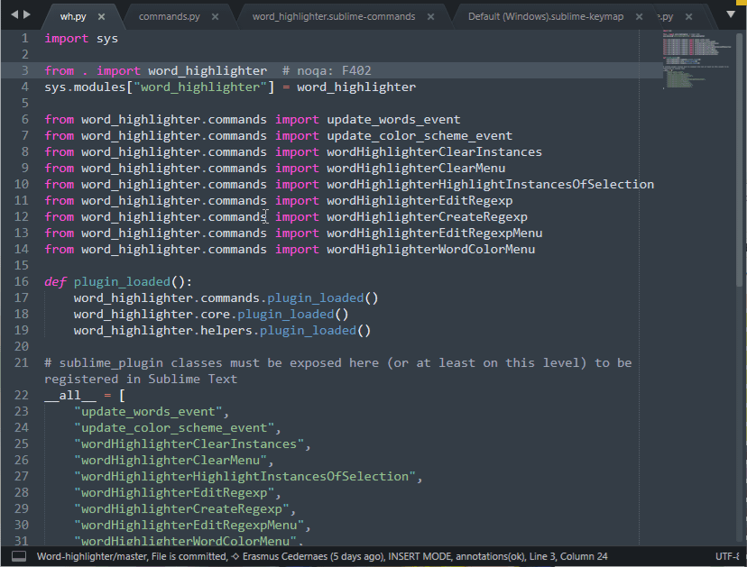

# Word highlighter for Sublime Text

The plugin is used for highlighting/colorizing occurances of words or patterns. This can simplify reading unfamiliar code, make it possible to look at the code in a new way, *or* just make the code colorful.

It is inspired by the Emacs plugin [highlight-symbol](http://nschum.de/src/emacs/highlight-symbol/).

## Usage
### Highlight selection (word)
<kbd>alt</kbd>+<kbd>k</kbd>, <kbd>h</kbd>, <kbd>w</kbd>

Toggles highlights based on the current selection.

* If the selection has zero width, it is expanded to the word boundary and will only match at the same word boundary.
* If the selection has non-zero width, the the whole selection will be matched irrespective of word boundaries.

### Clear highlights
<kbd>alt</kbd>+<kbd>k</kbd>, <kbd>h</kbd>, <kbd>c</kbd>

Clears all highlights.

### Clear highlights menu
<kbd>alt</kbd>+<kbd>k</kbd>, <kbd>h</kbd>, <kbd>m</kbd>, <kbd>c</kbd>

Get a list of all highlights and select which ones to clear from the view.

### Edit regexp of selection
<kbd>alt</kbd>+<kbd>k</kbd>, <kbd>h</kbd>, <kbd>e</kbd>, <kbd>r</kbd>

Edit the selected highlight's regexp (under the cursor).

### Edit regexp menu
<kbd>alt</kbd>+<kbd>k</kbd>, <kbd>h</kbd>, <kbd>m</kbd>, <kbd>e</kbd>, <kbd>r</kbd>

Edit the regexp for a highlighted by selecting from a menu (list of all highlights).

### New highlight from regexp
<kbd>alt</kbd>+<kbd>k</kbd>, <kbd>h</kbd>, <kbd>n</kbd>, <kbd>r</kbd>

Create a new highlight by entering a regexp.

### Edit highlight color
<kbd>alt</kbd>+<kbd>k</kbd>, <kbd>h</kbd>, <kbd>e</kbd>, <kbd>h</kbd>

Edit the selected highlight's color (under the cursor).

## Installation
Clone the repository and rename it to *word_highlighter*. Place it in the Sublime text *Packages* folder (**Preferences -> Browse Packages...**).
